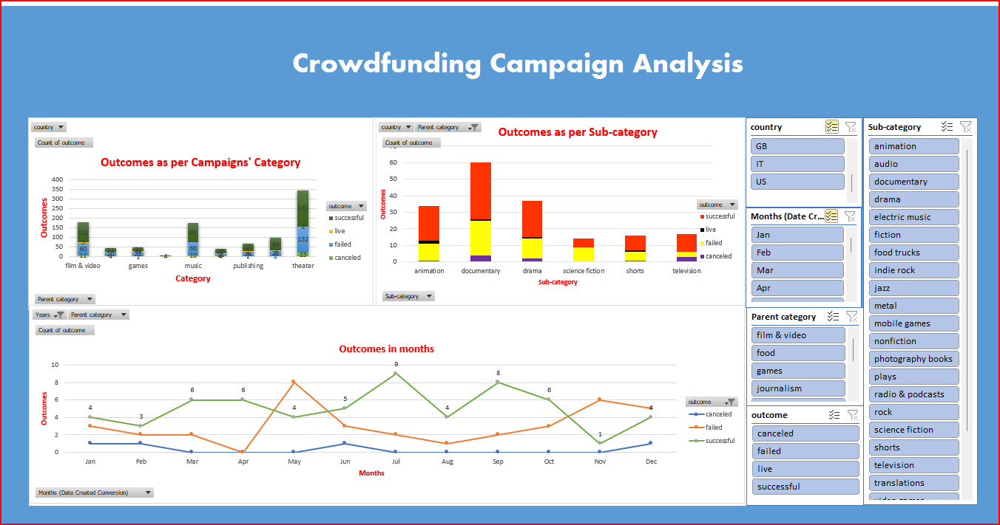

# Excel project

## Dashboard 

## Overview

Crowdfunding platforms like Kickstarter and Indiegogo have grown in success and popularity since the late 2000s. From independent content creators to celebrities, more and more people are using crowdfunding to launch new products and generate buzz, but only some projects have succeeded. To receive funding, the project must meet or exceed an initial goal, so many organizations dedicate considerable resources to reviewing old projects in an attempt to discover "the trick" to success.
I will organize and analyze a database of 1,000 sample projects for this project to uncover hidden trends. 

 **Given the provided data, what are three conclusions that we can draw about crowdfunding campaigns?**

**Answer:**  Three conclusions that we can draw from the provided dataset of 1,000 sample projects are briefly explained as follows:

1. **Crowdfunding is still a popular tool for product launching:**

 Based on the sample data, successful projects have more supporters than failed ones. Also, some successful campaign projects have significantly more supporters than others. The "Fox-Williams" project has the highest number of backers, i.e., 7295.
Likewise, out of 1,000 total sample campaigns, we found 565 counts of successful campaigns, whereas unsuccessful or failed campaigns are much less, which is 364. Based on this, we can infer that more than 50% of the sample campaigns were able to succeed. This rate may seem small, but with suitable projects, planning, and execution, the success rate can be drastically increased.

2. **The number of outcomes does not alone reflect the flourishing campaign category and sub-category:** 

Some projects under specific categories and sub-categories may give us the wrong impression of being the most successful ones if we only look at their counts of outcomes; however, it is not an accurate picture. For example, the category 'theater' has 187 successful outcomes out of 344 total outcomes of this category in all countries. However, let us compare that data to all other categories regarding the percentage of successful campaigns from the total of campaigns under that specific category. We will then realize a different picture here, as now we will see that only 54% of the total campaigns under the' theater' category have been successful. The same goes for the outcomes as per the sub-categories. Another category, "Film & Video," shows misleading pictures too. So far, the category "journalism" has secured a whopping 100% success rate among all categories, even though the outcomes quantitively seem very low. 
Hence, the analysis based on this success rate suggests that campaigns based on the "journalism" category are more likely to be successful. The categories, like theatre and, film and video, may become more popular as more projects are coming up, but they cannot guarantee 100% success. Likewise, the sub-categories "world music" and "audio" look very promising, with 100% success rates. It would be a great idea to explore these sub-categories further. 

3. **Campaigns during summer are more successful:**

 If we look at the outcomes of campaigns, we see they are more successful during June and July, which are the summer months. That does make sense, as people are more accessible during the summer season, as they have longer days, most children are on summer breaks, and people tend to go on vacations and enjoy more free time with their family members and friends. Hence, it is a perfect time to launch a new "popular" campaign.
 Moreover, if we dive deeper into the data and see which month has the highest success rate, we find the month of June is 64%, which is the highest, and the second highest is the month of July. One point to be noted here is that immediately following the month of July, during August, the line of outcomes significantly drops to 49%, suggesting people are less likely to invest their time and their resources into any campaigns for some time being, which again would incline above, during September gradually and then again go down and then again up, suggesting a change of pattern during different months of a single year.
Based on this trend, we can decide when to start working on our projects and initiate them for the most successful outcomes.

Thank you!

Author:

Stuti Poudel